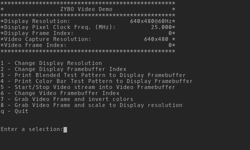
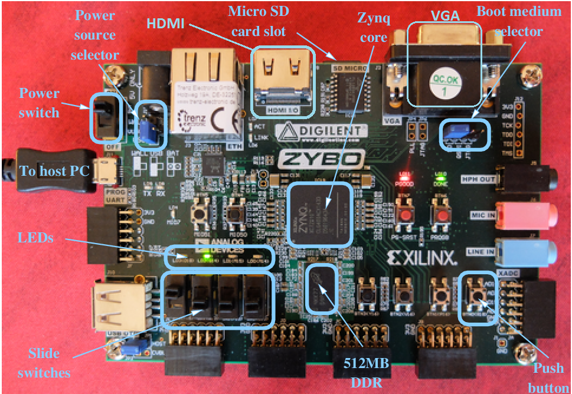

# Zybo HDMI in demo

* [Link to the project wiki](https://reference.digilentinc.com/learn/programmable-logic/tutorials/zybo-hdmi-demo/start)
* [Link to the project github](https://github.com/Digilent/Zybo-hdmi-in)

Officially it's a digilent project, but [it](https://github.com/Digilent/Zybo-hdmi-in) doesn't work in lived 2019.1, so I updated the project with the current **ips** and the *C* project was fixed in 

Author: João Amorim

Author email: joao-amorim@uergs.edu.br

Date: Nov-06-2019

**Abstract**

 This project is to get the HDMI from a source and put in the VGA 

# Table of content
* [License](../LICENSE)
* [Create the project](#Create)
* [Project specification](#specification)

# <a name="Create"></a>Create the project

First you need to create the design project, this can be done at tcl console by:

```bash
source HDMI_Demo_dump.tcl
```

this go create the design project, so now at interface or in console you need generate the [design file](./HDMI_Demo_hw.hdf). This can do the same for all other projects, you just need to **generate the bitstream** in the graphical interface or the tcl console. After generate the bitstream is need **export hardware** with the bitstream (in graphical interface of vivado 2019.1, you can do this in File > Export > Export Hardware).


With the **hardware** file exported previously, just go to *xilinx sdk application* and create a new empty project with the **hardware target**>**hardware platform** configured with the [design file](./HDMI_Demo_hw.hdf) and **hardware target**>**CPU** configured with **ps7_cortexa9_0**. 

**Note:** It is important to make sure that your **hardware platform** is configured correctly, with the hardware generate by the project at xilinx vivado.

After this, you need have a project with the *hardware platform*, *bsp* and a main project where go the *C* files. At the main project is need include the [c_sources](./c_sources/). 

* **hardware platform:** is the project with the hardware make in xilinx vivado and export previusly
* **bsp:** this is a project generate with the libs compatible with the hardware generate
* **main:** this is where go the project.


After compile this project, with the zybo connected you can program the FPGA (at Xilinx SDK, you can go in Xilinx > program FPGA checks the infos and program the FPGA). With the FPGA programed you can lauch on hardware the *C* project (at Xilinx SDK, click on the **main project** go at menu in Run > Run as > Lauch on hardware (System debuger)). 


With this the FPGA have our project, to use this demo you can connect with serial port with the configurations: 

* Port: depend where is connected the zybo (COMX)
* Baud rate: 115200
* Data bits: 8
* Stop bits: 1
* Parit: None
* Flow control: None

if all is correct the menu like the figure is show at the serial terminal:


# <a name="specification"></a>Some specification

This specification is copy from the students: Marco Lucarella, Enrico Gioia taken from [gitlab repository](https://gitlab.eurecom.fr/lucarell/HdmiAcquisition4Zybo)


### <a name="Description"></a>Project Description
The goal is to design a digital hardware for HDMI acquisition that allows to manipulate each pixel and then print the output on the VGA interface.

As reference and start point, we used an open source [project](https://reference.digilentinc.com/zybo:hdmidemo) provided by Digilent.  
The entire work is made up of several modules which are implemented either on the FPGA logic or on the CPU. Among them there are:

* **HDMI Acquisition (dvi2rgb)** : module created by Digilent able to interpret the HDMI protocol. It decodes the video stream and outputs 24-bit RGB video data along with the pixel clock and synchronization signals;
* **VGA writer (rgb2dvi)**: module to provide a properly blanked vga signal from an rgb interface
* **RGB to AXI**: module created by Digilent able to load the image on the RAM to be accessible from the CPU.


### <a name="Usage"></a>Usage

#### Gather your materials

Begin by gathering the materials:

* Zybo board (Zynq-7000 Development Board)
* Xilinx Vivado® Design Suite: Design Edition
* Micro USB cable
* 5V 2.5A switching power supply
* VGA Cable to connect to a monitor
* Monitor with a VGA Input
* HDMI cable
* HDMI video source (most modern laptop computers work or a GoPro)



### <a name="Details"></a>Project Details

#### Blocks overview

Among all blocks, the critical ones are described below:
* **dvi2rgb**: this is the block that read the HDMI interface.
	* the input TMDS is the name of the HDMI interface dedicated for video;
	* the output DDC is an I2C interface used by the devices connected to the HDMI in order to detect the resolution supported by the Zybo. This interface allows the peripheral to read a ROM stored in this block that can be configured using the block options;
	* the output RGB is composed of several signals:
		* vid_pData is contains the information on the pixel color coded using one byte for each color in the order BRG;
		* vid_pHSync and vid_pVSync represet the vertical and orizzontal sync signals;
		* vid_pVDE indicated if the video is enabled or not;
	* the output PixelClk is the clock extracted from the HDMI and it depends on the resolution used;
	* the output aPixelClkLckd is set to one when the block finish to detect the PixelClk;
	* the optional output SerialClk can be enabled from the block configuration and is equal to the PixelClk but five time faster.
* **v_vid_in_axi4s**: this is the block that creates the AXI interface in order to transmit the pixel to the RAM.
	* the input vid_io_in was originally connected to the RGB port of dvi2rgb and has the same pin.

#### CPU project

The CPU project provided different features:
* initialize the frames: inside the RAM are stored 3 frames, using the UART interface is possible to select what you want to write in each frame and witch frame do you want to visualize on the VGA;
* attach a callback on the HDMI status: every time the HDMI changes status a callback is executed to update the UART menu and if the HDMI is detected it starts automatically the streaming on the VGA;
* sample image: there are two sample image that is possible to show on the VGA using the UART menu. Other sample images can be added modifying the C code;
* adjust the resolution: using the UART menu is possible to select the resolution to use on both HDMI and VGA.
* capture a frame: is possible to capture a frame of the HDMI stream and do some software modification. The color inversion filter is already implemented and can be enabled from the UART menu.
