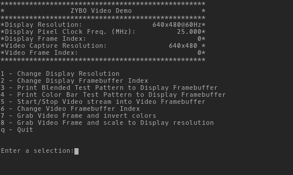

# Zybo stream HDMI

Author: João Amorim

Author email: joao-amorim@uergs.edu.br

Date: dez-01-2019

**Abstract**

This is a project based on digilent's "hdmi_in" demo. The demo stream from HDMI to VGA, this work proposes a capture card in a similar way, where in addition to VGA should be streamed video by sockets.

## Project content

* [c_sources](./c_sources/) - Contains the C projects of this project
  * [hdmi-in](./c_sources/hdmi-in/) - Contains the digilent demo project, which is an application that puts the HDMI (input) in the VGA (output). This demo is edited by *João L. Fragoso* to use in new version of vivado (2018/2019).
  * [UDP-client-perf](./c_sources/UDP-client-perf/) - Contains the demo project of xilinx, which is a performace client application with UDP sockets
  * [stream](./c_sources/stream/) - Contains the project that consists in accomplishing the objective of this project, VGA stream via sockets, where the VGA is the HDMI in.
* [python_sources](./python_sources/) - Contains the Python files of this project, to receive the data by sockets
* [HDL_sources](./HDL_sources/) - Contains the necessary files to generate the hardware project produced by me (files at [dir JGAA](./HDL_sources/JGAA/) - **this project doesn't work, it has some bug not found**) and the produced's by my teacher  *João L. Fragoso* to use in new version of vivado (2018/2019) (Files at [dir JLF](./HDL_sources/JLF/).
* Files produced by me - **attention**: these results made by me, have some non-corrected bug that is crashing the application after booting it in sdk
  * [blockDesign_dump_JGAA_Demo-hdmi-in.tcl](./blockDesign_dump_JGAA_Demo-hdmi-in.tcl) - File to generate the block design
  * [bitstream_dump_JGAA_Demo-hdmi-in.bit](./bitstream_dump_JGAA_Demo-hdmi-in.bit) - Bitstream of generated hardware
  * [HW_dump_JGAA_Demo-hdmi-in.hdf](./HW_dump_JGAA_Demo-hdmi-in.hdf) - The hardware file, this contain the bitstream
  * [project_dump_JGAA_Demo-hdmi-in.tcl](./project_dump_JGAA_Demo-hdmi-in.tcl) - File to generate the complete vivado project 
* Files produced by my teacher  *João L. Fragoso* - **attention**: *use this files!* They work as expected.
  * [blockDesign_dump_JLF_Demo-hdmi-in.tcl](./blockDesign_dump_JLF_Demo-hdmi-in.tcl) - File to generate the block design
  * [bitstream_dump_JLF_Demo-hdmi-in.bit](./bitstream_dump_JLF_Demo-hdmi-in.bit) - Bitstream of generated hardware
  * [HW_dump_JLF_Demo-hdmi-in.hdf](./HW_dump_JLF_Demo-hdmi-in.hdf) - The hardware file, this contain the bitstream
  * [project_dump_JLF_Demo-hdmi-in.tcl](./project_dump_JLF_Demo-hdmi-in.tcl) - File to generate the complete vivado project 


# Table of content
* [License](../LICENSE)
* [Create the project](#Create)

# <a name="Create"></a>Create the project

First you need to create the design project, this can be done at tcl console by:

```bash
source project_dump_JLF_Demo-hdmi-in.tcl
```

this go create the design project, so now at interface or in console you need generate the [design file](./HW_dump_JLF_Demo-hdmi-in.hdf). This can do the same for all other projects, you just need to **generate the bitstream** in the graphical interface or the tcl console. After generate the bitstream is need **export hardware** with the bitstream (in graphical interface of vivado 2019.1, you can do this in File > Export > Export Hardware).


With the **hardware** file exported previously, just go to *xilinx sdk application* and create a new empty project with the **hardware target**>**hardware platform** configured with the [design file](./HW_dump_JLF_Demo-hdmi-in.hdf) and **hardware target**>**CPU** configured with **ps7_cortexa9_0**. 

**Note:** It is important to make sure that your **hardware platform** is configured correctly, with the hardware generate by the project at xilinx vivado.

After this, you need have a project with the *hardware platform*, *bsp* and a main project where go the *C* files. At the main project is need include the [c_sources](./c_sources/). 

* **hardware platform:** is the project with the hardware make in xilinx vivado and export previusly
* **bsp:** this is a project generate with the libs compatible with the hardware generate
* **main:** this is where go the project.

To test if the design is correct, you should use the [hdmi-in](c_sources/hdmi-in/) [demo project](https://github.com/Digilent/Zybo-hdmi-in) to check if the project to capture HDMI and put it on the VGA output (this project in my repository has some updates to work on the 2018/2019 version of the SDK). It can also be tested the socket issue, through the demo project available in the SDK, the [UDP client perf](c_sources/UDP-client-perf/).


After compile this project, with the zybo connected you can program the FPGA (at Xilinx SDK, you can go in Xilinx > program FPGA checks the infos and program the FPGA). With the FPGA programed you can lauch on hardware the *C* project (at Xilinx SDK, click on the **main project** go at menu in Run > Run as > Lauch on hardware (System debuger)). 


With this the FPGA have our project, to use this demo you can connect with serial port with the configurations: 

* Port: depend where is connected the zybo (COMX)
* Baud rate: 115200
* Data bits: 8
* Stop bits: 1
* Parit: None
* Flow control: None

if all is correct the menu like the figure is show at the serial terminal:
